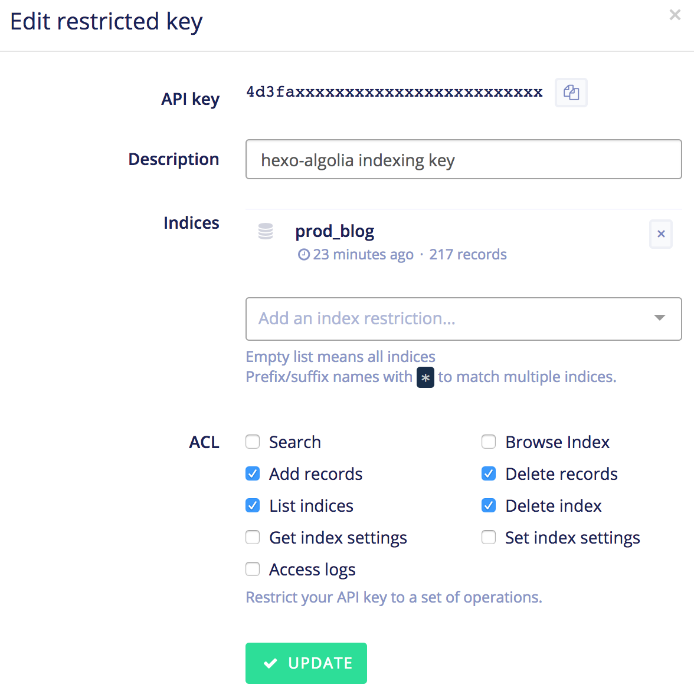

# hexo-algolia [](https://travis-ci.org/oncletom/hexo-algolia)

> Index content in Algolia Search API.

## Install

Compatible with `node>=4.0.0`.

```bash
$ npm install --save hexo-algolia
```

## Public Facing Search Options

You can configure Algolia integration to your hexo website with the `_config.yml` file:

``` yaml
algolia:
  applicationID: 'applicationID'
  apiKey: 'apiKey'
  indexName: '...'
```

| Config Key | |
| --- | --- |
| `applicationID` | Your Algolia Application ID |
| `apiKey` | A **Search-Only** API key |
| `indexName` | The name of the Algolia index to use |

These configuration values are **accessible from your hexo theme**, to be used with [Algolia JavaScript client](https://www.algolia.com/doc/guides/search/auto-complete/#user-interface).

## Hexo Helpers

Helpers are provided to make your life easier.

### Algolia JavaScript Client Tags

The plugin provides an easy way to add [Algolia JavaScript API Client][js-client] either _locally_ (served by hexo) or _remotely_ (via Algolia CDN).

```html
<%- algolia_search() %>
```

Renders as:

```html
<script src="/assets/algolia/algoliasearchLite.min.js" async></script>
```

```html
<%- algolia_search_cdn() %>
```

Renders as:

```html
<script src="https://cdn.jsdelivr.net/algoliasearch/3/algoliasearchLite.min.js" async></script>
```

### Configuration `<meta>` Tag

You can make your index configuration available to your page and client-side scripts by adding the `algolia_config()` hexo helper in the `<head>` of your document.

```html
<%- algolia_config() %>
```

Renders as:

```html
<meta property="algolia:search" data-application-id="..." data-api-key="..." data-index-name="...">
```

You can access the exposed configuration by querying the [`data attribute`](dataset) of the `algolia:search` meta tag:

```html
<script>
const algoliaConfig = document.querySelector('meta[property="algolia:search"]').dataset;

const client = algoliasearch(algoliaConfig.applicationID, algoliaConfig.apiKey);
const index = client.initIndex(algoliaConfig.indexName);
</script>
```

## Indexing Content

Content can be indexed from the _command line_ with the help of the `hexo algolia` command.

```bash
$ ./node_modules/.bin/hexo algolia
```

### API Key

A separate _API Key_ must be provided as an **environment variable** named `HEXO_ALGOLIA_INDEXING_KEY`. Create it with **these limited write access** permissions: `Add records`, `Delete records`, `List indices`, `Delete index`.

```bash
$ export HEXO_ALGOLIA_INDEXING_KEY=…
$ ./node_modules/.bin/hexo algolia
```


### Usage

```
$ ./node_modules/.bin/hexo help algolia
Usage: ./node_modules/.bin/hexo algolia

Description:
Index your content in Algolia Search API

Options:
  --chunk-size=5000  Chunk size for each batch of content to index
  --dry-run          Does not push content to Algolia
  --flush            Does not reset the Algolia index before starting the indexation
```

### Security Concerns

**Never store your _Admin API Key_** as `apiKey` in the `_config.yml` file: **it would give full control of your Algolia index to others** and [you don't want to face the consequences][daily-mirror-bonanza].

[Please read Algolia Security guide thoroughly][security] if you need some more informations about this.

# License

[MIT](LICENSE)


[js-client]: https://www.algolia.com/doc/api-client/javascript/
[batching]: https://www.algolia.com/doc/guides/indexing/import-synchronize-data/#batching
[security]: https://www.algolia.com/doc/guides/security/api-keys/
[dataset]: https://developer.mozilla.org/en-US/docs/Learn/HTML/Howto/Use_data_attributes
[daily-mirror-bonanza]: http://www.mirror.co.uk/all-about/cybersecurity
